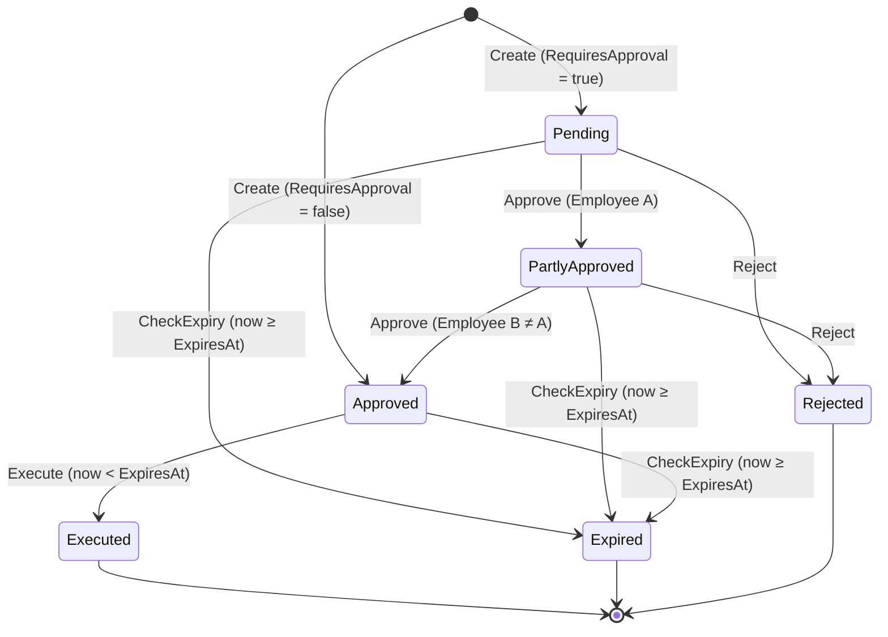

# MoneyTransfer - AI Single Prompt Challenge

A **.NET 10 / C# 14** console application modelling a money-transfer lifecycle.
It provides a strongly-typed, exception-free transfer lifecycle — create → approve → execute / expire / reject — wired through `Blazing.Extensions.DependencyInjection`.

---

## Overview

This repository is an **AI single-pass prompt project** created in response to Zoran Horvat's _["I Know These Design Flaws All Too Well"](https://www.youtube.com/watch?v=x3uSzF24cqM)_ video and the surrounding _"Can Claude Code design..."_ discussion.

The idea was to test how much useful structure, code, validation, documentation, and test coverage could be produced from a single, tightly scoped prompt for a realistic domain problem rather than an overly toy example.

That original prompt is included in [`docs/prompt.md`](docs/prompt.md), so the project can be read both as a working sample and as a prompt-to-output experiment.

---

## Table of Contents

- [Overview](#overview)
- [Quick Start](#quick-start)
- [Transfer Lifecycle](#transfer-lifecycle)
- [Project Structure](#project-structure)
- [How to Use](#how-to-use)
- [Testing](#testing)
- [Key Design Decisions](#key-design-decisions)
- [Validation Rules](#validation-rules)
- [Documentation](#documentation)
- [Technology Stack](#technology-stack)

---

## Quick Start

### Prerequisites

- [.NET 10 SDK](https://dotnet.microsoft.com/download/dotnet/10.0)
- [Blazing.Extensions.DependencyInjection](https://www.nuget.org/packages/Blazing.Extensions.DependencyInjection) (for DI container and `[AutoRegister]`)
- [FluentValidation](https://www.nuget.org/packages/FluentValidation) (for command validation)
- [Shouldly](https://www.nuget.org/packages/Shouldly) (for fluent assertions in tests)

### Run

```bash
git clone <repo-url>
cd MoneyTransfer/src
dotnet run
```

Expected output:

```
=== Scenario 1: Auto-approved transfer ===
  [OK ] Create
  [OK ] Execute
  Status: Executed

=== Scenario 2: Two-approval transfer ===
  [OK ] Create
  [OK ] Approve (employee A)
  Status: PartlyApproved
  [OK ] Approve (employee B)
  Status: Approved
  [OK ] Execute
  Status: Executed

=== Scenario 3: Same-employee double-approval ===
  [ERR] Duplicate approval — The second approver must be a different employee from the first.

=== Scenario 4: Reject from Pending ===
  [OK ] Reject
  Status: Rejected

=== Scenario 5: Expired transfer ===
  [OK ] Create
  Status before expiry: Approved
  Status after expiry:  Expired
```

---

## Transfer Lifecycle



---

## Project Structure

```
MoneyTransfer/
├── src/
│   ├── Common/
│   │   └── Result.cs                  Result / Result<T> — exception-free error propagation
│   ├── Models/
│   │   ├── Ids.cs                     Strongly typed IDs: TransferId, AccountId, EmployeeId
│   │   ├── TransferStatus.cs          Lifecycle enum (6 states)
│   │   ├── MoneyTransfer.cs           Domain entity with guard-clause state transitions
│   │   └── MoneyTransferBuilder.cs    Fluent builder — only way to construct MoneyTransfer
│   ├── Validators/
│   │   ├── CreateTransferValidator.cs  CreateTransferCommand + FluentValidation rules
│   │   ├── ApproveTransferValidator.cs ApproveTransferCommand + FluentValidation rules
│   │   └── RejectTransferValidator.cs  RejectTransferCommand + FluentValidation rules
│   ├── Services/
│   │   ├── ITransferService.cs        Public service contract
│   │   └── TransferService.cs         Implementation — validate first, then delegate to model
│   └── Program.cs                     DI wiring + demo scenarios
└── tests/
    └── MoneyTransfer.Tests/
        ├── Fixtures/                  Shared test data + builder helpers
        ├── UnitTests/                 Isolated unit tests (Common, Models, Services, Validators)
        └── IntegrationTests/          End-to-end lifecycle scenarios via real DI
```

---

## How to Use

### 1 — Wire up DI

```csharp
using Blazing.Extensions.DependencyInjection;
using FluentValidation;
using Microsoft.Extensions.DependencyInjection;
using MoneyTransfer.Services;

var services = new ServiceCollection();
services.AddSingleton<TimeProvider>(TimeProvider.System);
services.AddValidatorsFromAssemblyContaining<Program>(ServiceLifetime.Singleton);
services.Register();   // scans [AutoRegister] — registers TransferService

var provider = services.BuildServiceProvider();
var svc = provider.GetRequiredService<ITransferService>();
```

### 2 — Create a transfer

```csharp
using MoneyTransfer.Models;
using MoneyTransfer.Validators;

var source = AccountId.New();
var dest   = AccountId.New();

// Auto-approved (no employee sign-off required)
var result = svc.Create(new CreateTransferCommand(
    SourceAccountId:      source,
    DestinationAccountId: dest,
    Amount:               250.00m,
    Currency:             "USD",
    RequiresApproval:     false,
    ExpiresAt:            DateTimeOffset.UtcNow.AddDays(7)));

if (!result.IsSuccess)
{
    Console.WriteLine($"Failed: {result.Error}");
    return;
}

var transfer = result.Value!;   // MoneyTransfer, Status = Approved
```

### 3 — Execute an auto-approved transfer

```csharp
var execResult = svc.Execute(transfer);

if (execResult.IsSuccess)
    Console.WriteLine($"Executed at {transfer.ExecutedAt}");
else
    Console.WriteLine($"Failed: {execResult.Error}");
```

### 4 — Create a dual-approval transfer

```csharp
var result = svc.Create(new CreateTransferCommand(
    source, dest, 10_000m, "EUR", RequiresApproval: true,
    ExpiresAt: DateTimeOffset.UtcNow.AddDays(2)));

var transfer = result.Value!;   // Status = Pending

var empA = EmployeeId.New();
var empB = EmployeeId.New();

// First approval: Pending → PartlyApproved
svc.Approve(transfer, new ApproveTransferCommand(empA));

// Second approval (different employee): PartlyApproved → Approved
var approveResult = svc.Approve(transfer, new ApproveTransferCommand(empB));
```

### 5 — Reject a transfer

> Rejection is valid from `Pending` or `PartlyApproved` only.

```csharp
var rejectResult = svc.Reject(transfer, new RejectTransferCommand(empA));

if (rejectResult.IsSuccess)
    Console.WriteLine($"Rejected by {transfer.RejectedById}");
```

### 6 — Check expiry

> Call periodically (e.g. background job) to mark expired transfers.
> The operation is idempotent and always returns `Result.Ok`.

```csharp
svc.CheckExpiry(transfer);
Console.WriteLine(transfer.Status);  // Expired (if past ExpiresAt)
```

---

## Testing

### Run Tests

```bash
dotnet test MoneyTransfer.sln
```

Expected output: `Failed: 0, Passed: 80, Skipped: 0`

### Test Layout

| Folder                  | Coverage                                         |
| ----------------------- | ------------------------------------------------ |
| `UnitTests/Common/`     | `Result` / `Result<T>` success and failure paths |
| `UnitTests/Models/`     | All state transitions, guard clauses, builder    |
| `UnitTests/Services/`   | Validation gate, delegation, time injection      |
| `UnitTests/Validators/` | All FluentValidation rules per command           |
| `IntegrationTests/`     | End-to-end lifecycle via real DI container       |

---

## Key Design Decisions

| Decision                  | Detail                                                                                                                   |
| ------------------------- | ------------------------------------------------------------------------------------------------------------------------ |
| **No exceptions**         | Every fallible operation returns `Result` / `Result<T>`; callers must handle failures                                    |
| **Validate before logic** | `TransferService` always runs FluentValidation before touching the model                                                 |
| **Fluent builder**        | `MoneyTransferBuilder` with an `internal Build()` — prevents accidental direct construction                              |
| **Strongly typed IDs**    | `TransferId`, `AccountId`, `EmployeeId` are `readonly record struct`; mix-up is a compile error                          |
| **ISO-4217 currency**     | Validated against a `FrozenSet<string>` — O(1) lookup, zero allocation                                                   |
| **Injected time**         | `TimeProvider` is injected and passed into model methods; no ambient `DateTime.UtcNow`                                   |
| **[AutoRegister] DI**     | `TransferService` carries `[AutoRegister(Singleton, typeof(ITransferService))]`; one `services.Register()` call wires it |

---

## Validation Rules

| Field                         | Rule                                    |
| ----------------------------- | --------------------------------------- |
| `SourceAccountId`             | Non-empty GUID                          |
| `DestinationAccountId`        | Non-empty GUID, must differ from source |
| `Amount`                      | Strictly greater than zero              |
| `Currency`                    | Valid ISO-4217 code (case-insensitive)  |
| `ExpiresAt`                   | Strictly in the future at creation time |
| `EmployeeId` (approve/reject) | Non-empty GUID                          |

---

## Documentation

| Document                                                                   | Description                                                        |
| -------------------------------------------------------------------------- | ------------------------------------------------------------------ |
| [docs/prompt.md](docs/prompt.md)                                           | Original single-pass AI implementation prompt used for the project |
| [docs/initial-implementation-plan.md](docs/initial-implementation-plan.md) | AI-generated implementation plan produced from the prompt          |
| [docs/architecture.md](docs/architecture.md)                               | Component diagram, class diagram, design patterns                  |
| [docs/use-cases.md](docs/use-cases.md)                                     | Sequence diagrams for every operation, business rules              |
| [docs/flow.md](docs/flow.md)                                               | State machine, flowcharts for all lifecycle paths                  |

---

## Technology Stack

| Technology                                     | Version   | Purpose                                                 |
| ---------------------------------------------- | --------- | ------------------------------------------------------- |
| .NET / C#                                      | 10.0 / 14 | Target framework and language                           |
| FluentValidation                               | latest    | Command validation at service boundary                  |
| FluentValidation.DependencyInjectionExtensions | latest    | `AddValidatorsFromAssemblyContaining<T>()`              |
| Blazing.Extensions.DependencyInjection         | latest    | `[AutoRegister]` + `services.Register()` for console DI |
