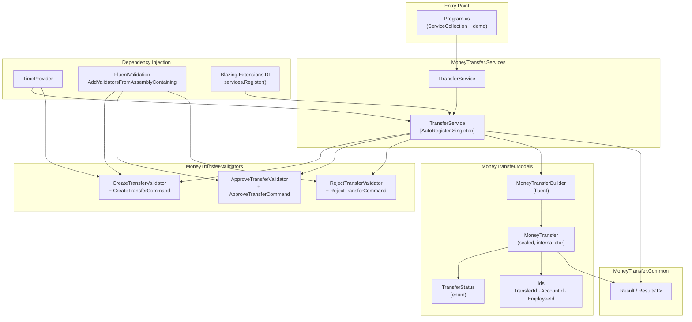
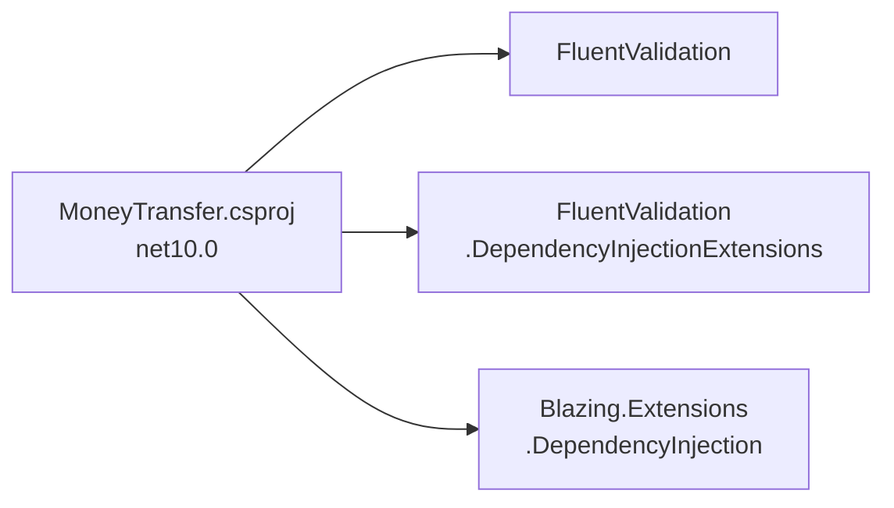
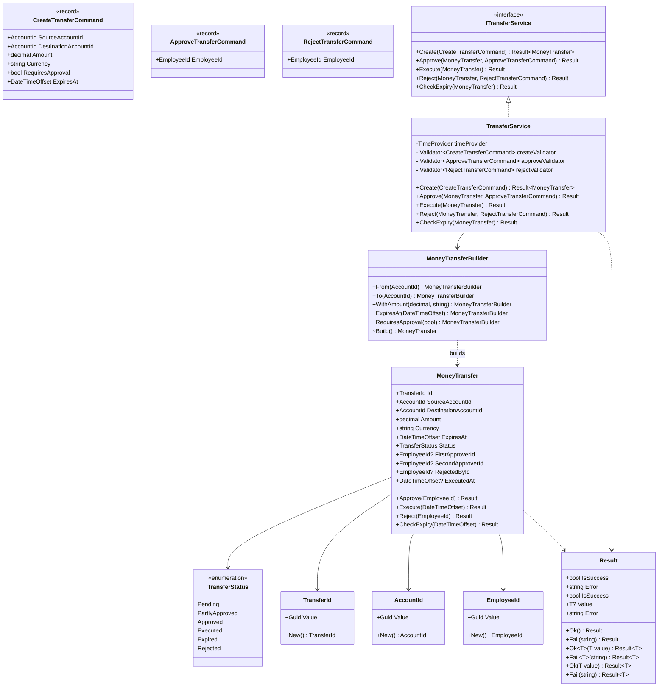

# Architecture

## Overview

MoneyTransfer is a **.NET 10 / C# 14** console application that models a
money-transfer lifecycle. It is structured in four layers:

| Layer          | Namespace                  | Responsibility                                     |
| -------------- | -------------------------- | -------------------------------------------------- |
| **Common**     | `MoneyTransfer.Common`     | Shared primitives (`Result<T>`)                    |
| **Models**     | `MoneyTransfer.Models`     | Domain entity, IDs, status enum, fluent builder    |
| **Validators** | `MoneyTransfer.Validators` | FluentValidation command records + validators      |
| **Services**   | `MoneyTransfer.Services`   | Service interface and DI-registered implementation |

---

## Component Diagram

---

## Package Dependencies

---

## Class Diagram

---

## Design Patterns

| Pattern                       | Where Applied                           | Rationale                                                                                 |
| ----------------------------- | --------------------------------------- | ----------------------------------------------------------------------------------------- |
| **Fluent Builder**            | `MoneyTransferBuilder`                  | Clean construction DSL; `internal Build()` enforces construction only through the service |
| **Result / Railway-oriented** | `Result` / `Result<T>`                  | Zero exceptions; every failure is an explicit typed return value                          |
| **Guard-clause transitions**  | `MoneyTransfer` methods                 | Two-line checks; readable, no state machine overhead                                      |
| **Boundary Validation**       | `TransferService` + FluentValidation    | Validates commands before any domain logic runs; domain model stays clean                 |
| **Strongly Typed IDs**        | `TransferId`, `AccountId`, `EmployeeId` | Prevents parameter mix-up at compile time                                                 |
| **[AutoRegister] DI**         | `TransferService`                       | Minimal registration boilerplate; assembly-scan wiring                                    |
| **Injected time**             | `TimeProvider`                          | Deterministic testing; no `DateTime.UtcNow` in production code                            |

---

## Key Constraints

- **No exceptions thrown** anywhere in the domain or service layer
- **Validation first** — every `TransferService` method validates its command before touching the model
- **`internal` constructor** — `MoneyTransfer` can only be created inside the assembly via `MoneyTransferBuilder`
- **ISO-4217 currency** — validated against a `FrozenSet<string>` for O(1) allocation-free lookup
- **`TimeProvider` injection** — expiry comparisons always use injected time, never ambient `UtcNow`
