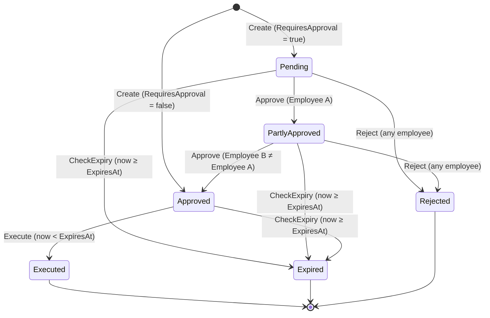
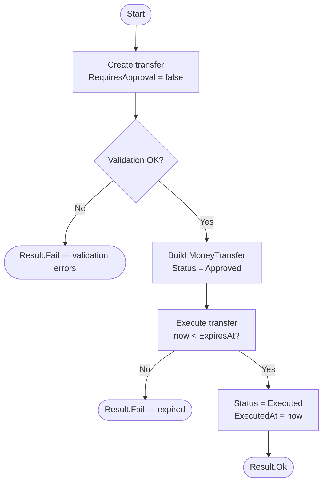
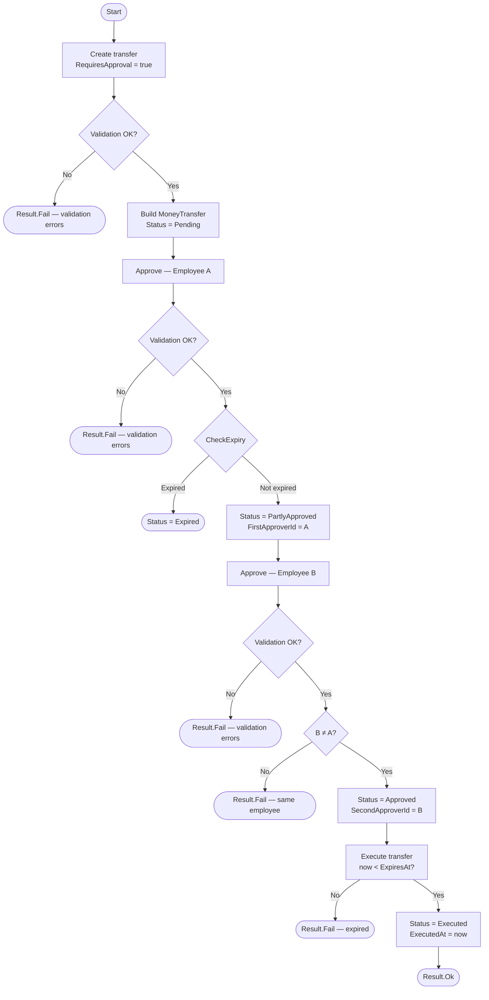
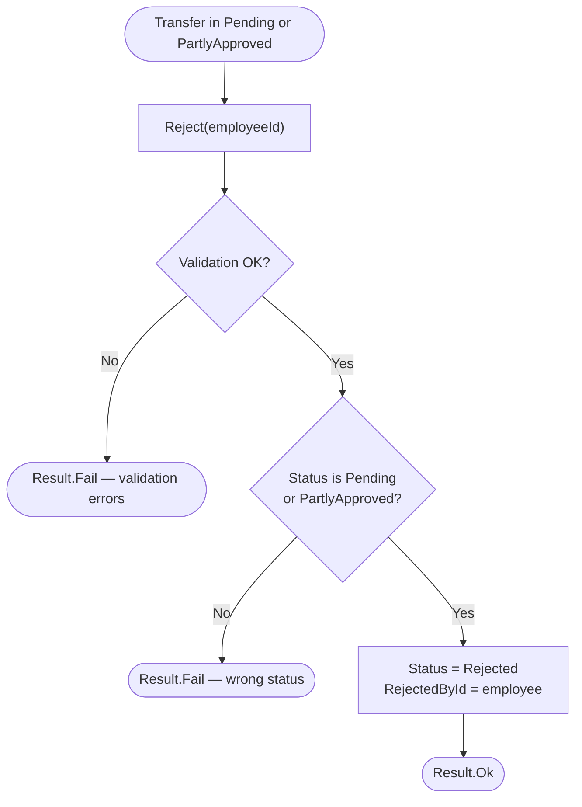
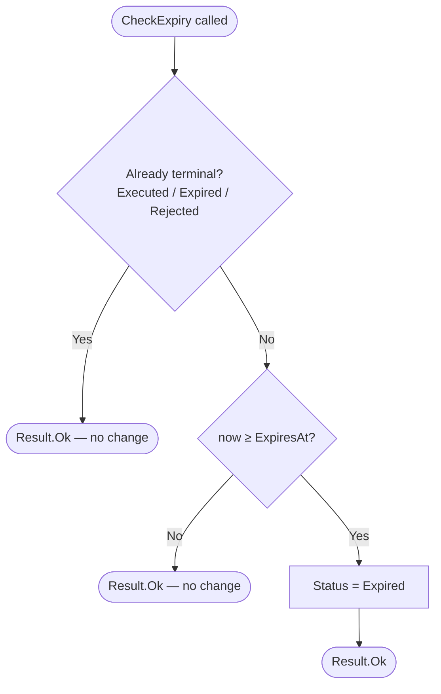
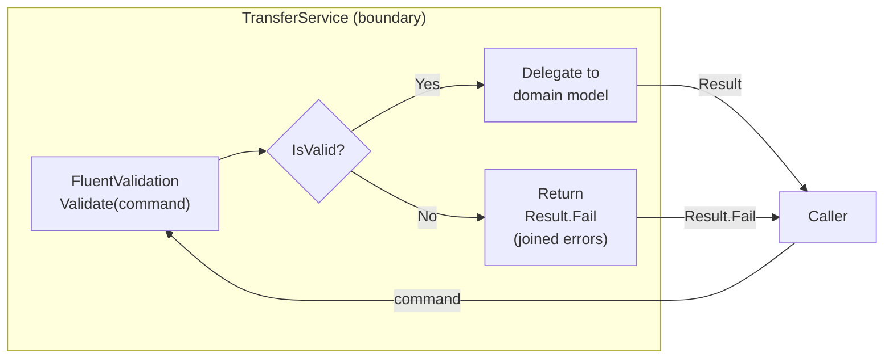
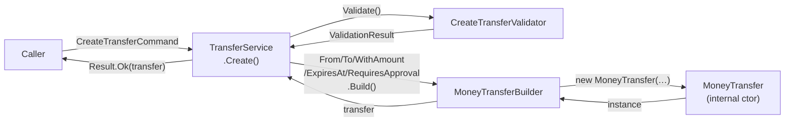

# Flow

## Transfer Lifecycle State Machine

---

## Happy Path — Auto-Approved Transfer

---

## Happy Path — Dual-Approval Transfer

---

## Rejection Flow

---

## Expiry Flow

---

## Service Validation Flow (All Operations)

---

## Data Flow — Create Transfer

---

## Guard Clause Decision Table

| State on entry                             | Operation          | Condition                | Outcome                                   |
| ------------------------------------------ | ------------------ | ------------------------ | ----------------------------------------- |
| `Pending`                                  | `Approve(emp)`     | —                        | `PartlyApproved`; store `FirstApproverId` |
| `PartlyApproved`                           | `Approve(emp)`     | `emp ≠ FirstApproverId`  | `Approved`; store `SecondApproverId`      |
| `PartlyApproved`                           | `Approve(emp)`     | `emp == FirstApproverId` | `Result.Fail`                             |
| Any other                                  | `Approve(emp)`     | —                        | `Result.Fail`                             |
| `Approved`                                 | `Execute(now)`     | `now < ExpiresAt`        | `Executed`; store `ExecutedAt`            |
| `Approved`                                 | `Execute(now)`     | `now ≥ ExpiresAt`        | `Result.Fail`                             |
| Any other                                  | `Execute(now)`     | —                        | `Result.Fail`                             |
| `Pending` or `PartlyApproved`              | `Reject(emp)`      | —                        | `Rejected`; store `RejectedById`          |
| Any other                                  | `Reject(emp)`      | —                        | `Result.Fail`                             |
| Terminal (`Executed`/`Expired`/`Rejected`) | `CheckExpiry(now)` | —                        | `Result.Ok` (no change)                   |
| Non-terminal                               | `CheckExpiry(now)` | `now ≥ ExpiresAt`        | `Expired`                                 |
| Non-terminal                               | `CheckExpiry(now)` | `now < ExpiresAt`        | `Result.Ok` (no change)                   |
