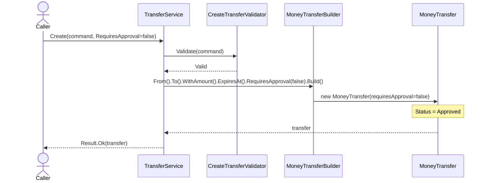
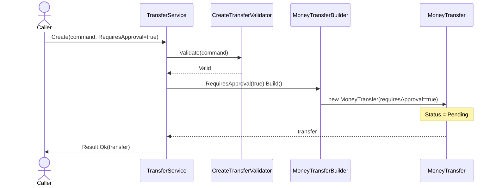
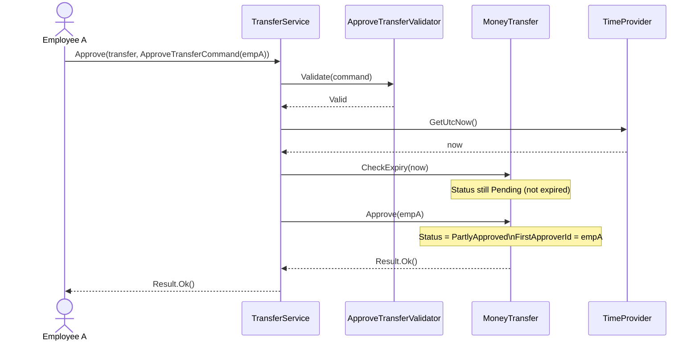
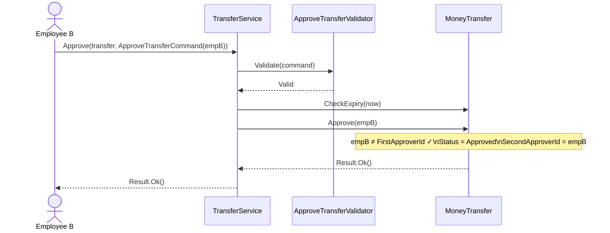
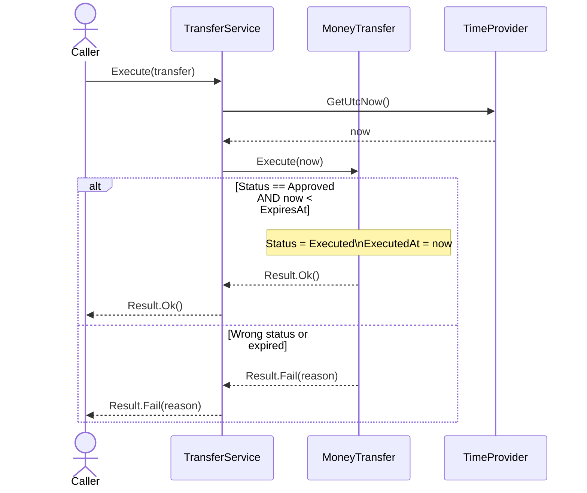
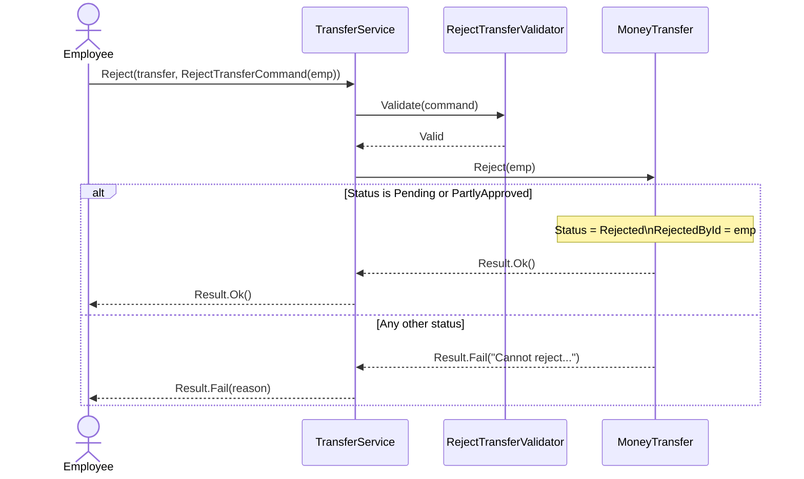
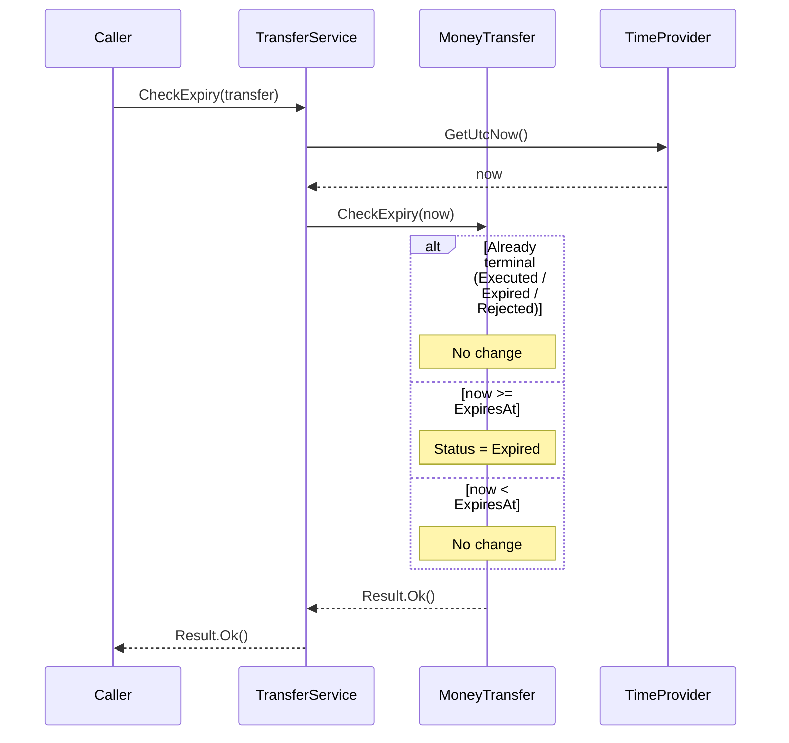
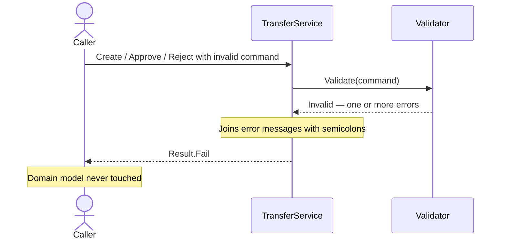
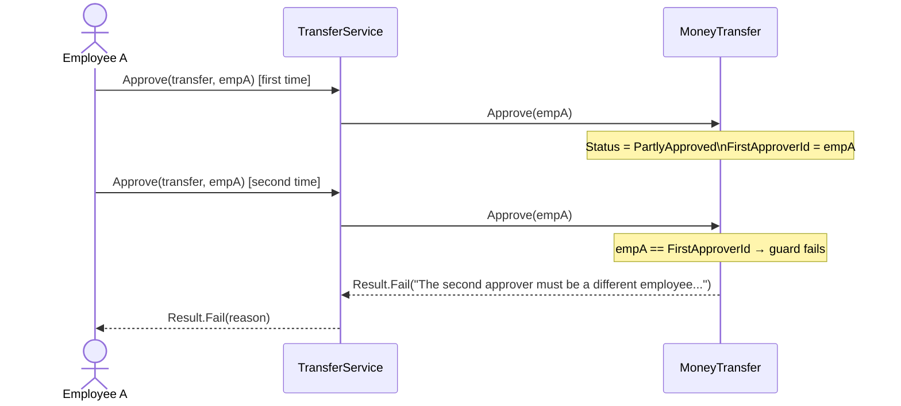

# Use Cases

## Actors

| Actor                     | Description                                                                                |
| ------------------------- | ------------------------------------------------------------------------------------------ |
| **Caller**                | Any code that resolves `ITransferService` — the entry point or a higher-level orchestrator |
| **Employee A**            | The employee who grants first approval                                                     |
| **Employee B**            | A _different_ employee who grants second approval                                          |
| **System (TimeProvider)** | Provides the current UTC timestamp for expiry and execution checks                         |

---

## UC-01 — Create Auto-Approved Transfer

> The caller creates a transfer that does not require manual approval.
> The transfer is immediately in `Approved` state and ready to execute.

---

## UC-02 — Create Transfer Requiring Approval

> The caller creates a transfer that requires sign-off from two different employees.
> The transfer starts in `Pending` state.

---

## UC-03 — First Approval (Pending → PartlyApproved)

> Employee A approves a pending transfer.

---

## UC-04 — Second Approval (PartlyApproved → Approved)

> A _different_ employee B approves a partly-approved transfer.

---

## UC-05 — Execute Transfer

> An approved transfer is settled before its expiry timestamp.

---

## UC-06 — Reject Transfer

> An employee rejects a transfer that is `Pending` or `PartlyApproved`.

---

## UC-07 — Check Expiry

> The system checks whether a transfer has passed its expiry timestamp.
> This operation is idempotent and never fails.

---

## UC-08 — Validation Failure

> Any command that fails FluentValidation returns a `Result.Fail` before domain logic runs.

---

## UC-09 — Same-Employee Double Approval (Guard)

> The same employee attempts to provide both approvals.
> The model rejects the second attempt.

---

## Business Rules Summary

| Rule                                                                    | Enforced In                                           |
| ----------------------------------------------------------------------- | ----------------------------------------------------- |
| Amount must be positive                                                 | `CreateTransferValidator`                             |
| Currency must be valid ISO-4217                                         | `CreateTransferValidator`                             |
| Source ≠ Destination account                                            | `CreateTransferValidator`                             |
| Expiry must be in the future                                            | `CreateTransferValidator`                             |
| Employee ID must not be empty                                           | `ApproveTransferValidator`, `RejectTransferValidator` |
| Auto-approved transfer starts `Approved`                                | `MoneyTransfer` constructor                           |
| Approval-required transfer starts `Pending`                             | `MoneyTransfer` constructor                           |
| First approval: `Pending` → `PartlyApproved`                            | `MoneyTransfer.Approve`                               |
| Second approval: `PartlyApproved` → `Approved`, different employee only | `MoneyTransfer.Approve`                               |
| Execution: `Approved` + now before expiry only                          | `MoneyTransfer.Execute`                               |
| Rejection: `Pending` or `PartlyApproved` only                           | `MoneyTransfer.Reject`                                |
| Expiry check: idempotent, never fails                                   | `MoneyTransfer.CheckExpiry`                           |
| No exceptions thrown anywhere                                           | All layers                                            |
